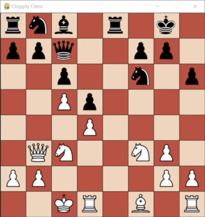

# Chess Engine Personal Project
A project to build a chess engine capable of at least being able to beat me at chess. This started as a passion project during COVID when I had just graduated from university as a playground for me to learn, build and experiment with different deep learning frameworks and techniques.

This legacy version of the project is stored locally on my machine as the majority of the models and datasets are far too large to host on github. Alternatively I have provided "lightweight" equivalent models that are built using the same techniques but are far smaller in file size and less capable at chess. 

## Project History
I have been continuously developing this project for around 4 years now and it has seen many iterations. The Initial build was mostly concerned with the generation of a functional 2-player chess game and ui "Chess (No Engine).ipynb".

The first version involving an ML oponent utilised a simple multi-layer perceptron model from SciKit-Learn and trained using a dataset of public games published by Lichess.com. The design rationale was to train the model on games that have been evaluated by stockfish (One of the storngest chess engines in the world) and see if it could predict the same evaluation. 

From there improvements to the engine fell into one of two catagories:
- Improvements to the model itself
- Improvements to the surrounding AI systems

Improvements to the model itself involved switching to ML frameworks that provide more flexibility and control of the specific model architecture such as Pytorch and Tensorflow. Pytorch was the main framework used for developing future iterations and the current best model is built using it. It boasts a more complex network composition including dropout layers, activation layers, and batch normalisation layers. The Tensorflow varients are mostly copies of the pytorch varients that were built to familiarise myself with the differences between the two frameworks. 

However, at this point the engine could only predict an evaluation for a given chess position and was unable to see into the future. This is where improvements to the surrounding AI systems come into play. The first improvment was the implementation of a tree search algorithm that could search all possible moves and all possible responses to those moves to a given calculation depth. Each of these moves was then evaluated by the engine and the move hat leads down the optimal branch is played. However, this leads to a calculation depth of 4 needing to potential evaluate over 1 million positions. To rectify this I implemented an alpha-beta pruning algorithm that punes search trees that are determined to be sub-optimal cutting down on the total computation cost per move. Additionally, evaluated positions are stroed in a dictionary so that repeat calculation is avoided.
